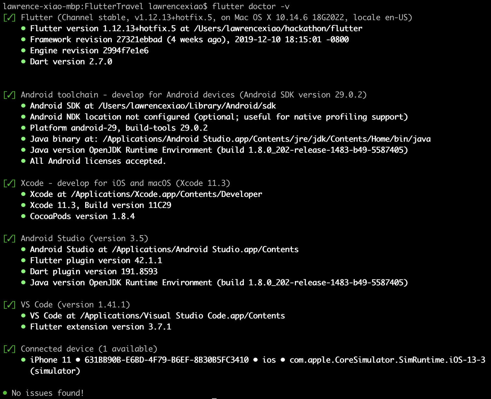
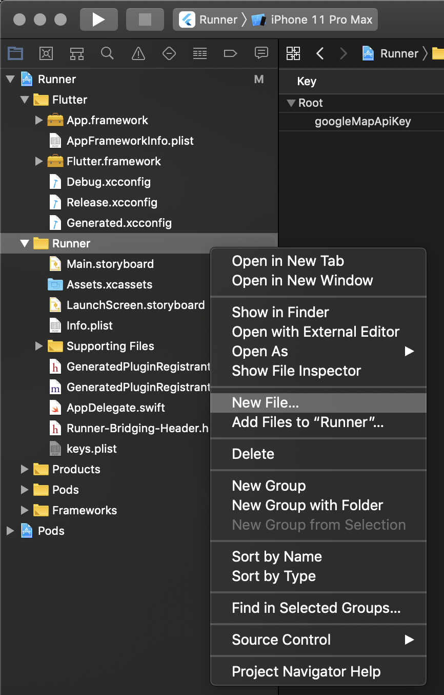
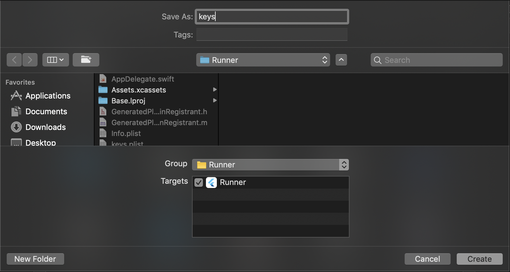
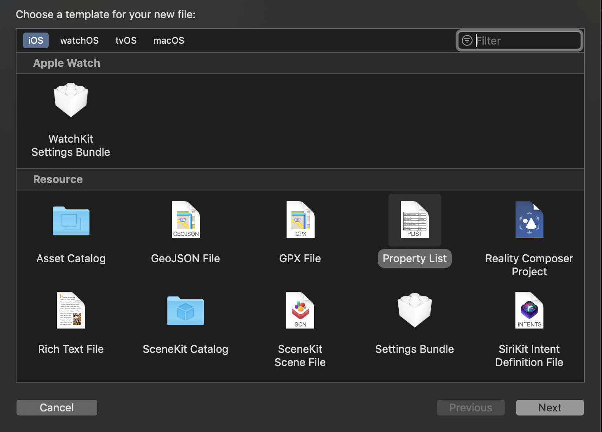
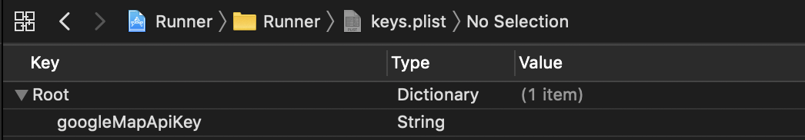

English | [简体中文](./README.zh-CN.md)
# 🛫Flutter Travel App Concept 

Flutter implementation of a Travel App Concept found in Uplabs with location features. 
**It only consists of 2 screens.**

Star⭐ the repo if you like what you see😉.

Images are from [Unsplash](https://unsplash.com)
## 📸 ScreenShots

| 1 | 2|
|------|-------|
|||

| 3 | 4|
|------|-------|
|||

## Toggle theme
To toggle the theme, change the `isDark` variable in `main.dart`.

`true` for dark and `false` for light.

## ✨ Requirements
* Any Operating System (ie. MacOS X, Linux, Windows)
* Any IDE with Flutter SDK installed (ie. IntelliJ, Android Studio, VSCode etc)
* A little knowledge of Dart and Flutter
* A brain to think 🤓🤓

## 🤓 Author(s)
**Olusegun Festus Babajide**  
**Lawrence Xiao Delong**

## ☕️  Donate

Buy me a cup of Coffee😁

| Mode | Link/Wallet|
| ------| ------------|
| Bitcoin | - |

## Getting Started

This is a personal project built on top of an open-source Flutter application, [FlutterTravel](https://github.com/JideGuru/FlutterTravel):
- [Google Maps Flutter](https://pub.dev/packages/google_maps_flutter) added to include google map page
- [Geolocater](https://pub.dev/packages/geolocator) added to get current geolocation and calculate distance between two coordinates

A few resources to get you started if this is your first Flutter project:

- [Lab: Write your first Flutter app](https://flutter.io/docs/get-started/codelab)
- [Cookbook: Useful Flutter samples](https://flutter.io/docs/cookbook)

For help getting started with Flutter, view our 
[online documentation](https://flutter.io/docs), which offers tutorials, 
samples, guidance on mobile development, and a full API reference.

In order to run this app, you need to:
1. Fork and clone this repository and open with [VS Code](https://code.visualstudio.com/) editor
2. Fix all requirements from outputs of command `flutter doctor -v` to make all dependencies appearing green  
      
3. Generate your personal/enterprise API key from [Google Maps Platform](https://cloud.google.com/maps-platform/pricing/)
4. Save this API key as environmental variable for android build to use  
    4.1. Open `~/.bash_profile` using your preferred editor from terminal  
    4.2. Save this line: `export googleMapApiKey=Axxxxxxxxxxxxxxxxxxxxxxxxxxxxxxxx`  
    4.3. `source ~/.bash_profile` or reopen the terminal  
5. Save this API key to keys.plist dictionary for ios build to use  
    5.1. Open the `/ios` folder from Xcode  
    5.2. Create `keys.plist` under `/Runner` folder  
        
        
          
    5.3. Save key `googleMapApiKey` value `Axxxxxxxxxxxxxxxxxxxxxxxxxxxxxxxx` pair in `keys.plist`  
          
6. `flutter run` to start the app on your preferred simulator or device

## LICENCE
[WTFPL](http://www.wtfpl.net/about/)